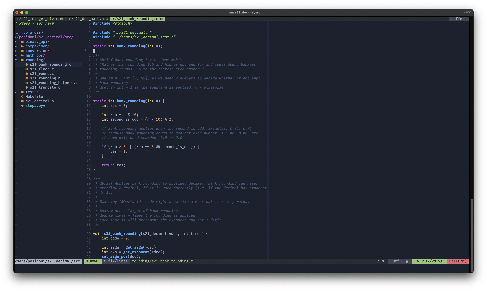

# My .rc files



## Usage

``` bash
$ git clone https://github.com/MikhailKuzntsov1/myrc.git
$ cd myrc
$ ./install.sh
```

## Credits
- Some things in `.vimrc` & `.tmux.conf` were stolen from my fellow S21 students 
[@reysand](https://github.com/reysand/dotfiles) and [@bezlant](https://github.com/bezlant). 
I'm greatful to you for making your dot files public.
It's definitely worth checking out these guys configs! :)
