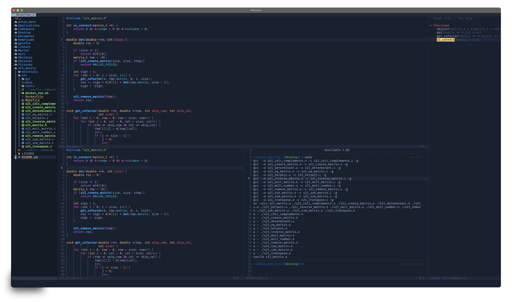
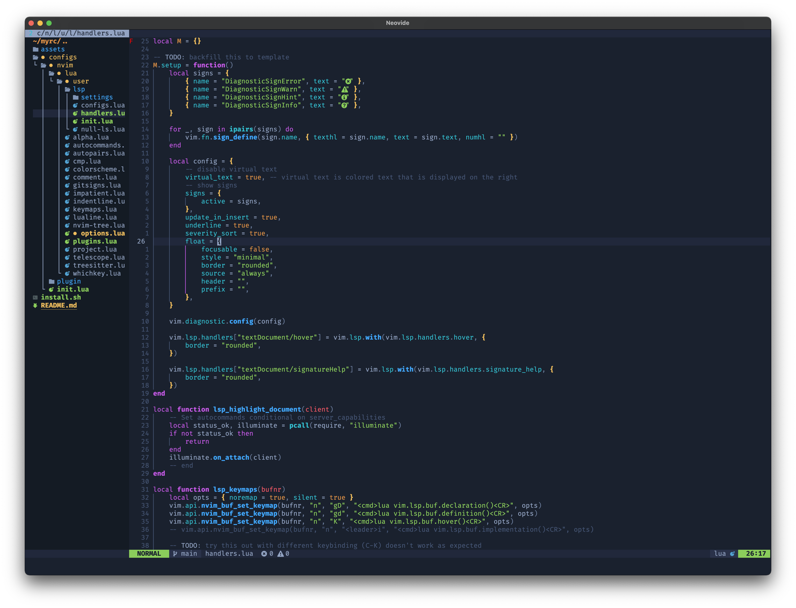
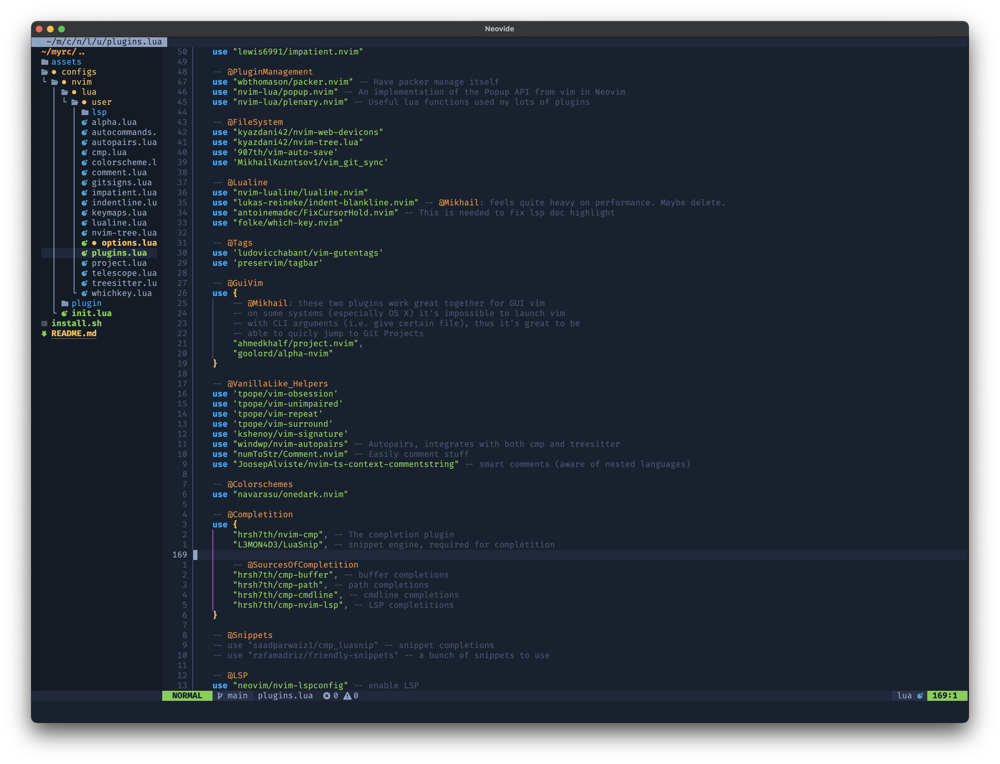

# My config files

## Terminal

- Recommended terminal emulators: [Alacrity for GNU/Linux](https://github.com/alacritty/alacritty), [iTerm2 for OS X](https://github.com/gnachman/iTerm2)
- For better experience with my Nvim config I recommend using [FiraCode Nerd Font with ligatures & default icons](https://github.com/ryanoasis/nerd-fonts)

## Nvim config

- My neovim config is written with mostly lua
- This config is compatible with both console Nvim & GUI versions
- My preferred GUI is [Neovide](https://github.com/neovide/neovide)

## Credits

- Some things in `.vimrc` & `.tmux.conf` were stolen from my fellow S21 students
  [@reysand](https://github.com/reysand/dotfiles) and [@bezlant](https://github.com/bezlant).
  I'm grateful to you for making your dot files public.
  It's definitely worth checking out these guys configs! :)
- [Christian Chiarulli @ChristianChiarulli](https://github.com/ChristianChiarulli) created awesome
  tutorial on lua configuration of NeoVim. It is available on [Youtube](https://www.youtube.com/watch?v=ctH-a-1eUME&t=9s&ab_channel=chris%40machine). Many things in my NeoVim
  are based on his tutorial. Although, some things in this tutorial may be outdated.
- [TJ DeVries](https://github.com/tjdevries), one of the NVim enthusiasts, delievered a great [talk](https://www.youtube.com/watch?v=IK_-C0GXfjo) on the concept of PDE, which I absolutely recomment checking out.
- Special thanks to all FOSS developers, nothing would be possible without you.
