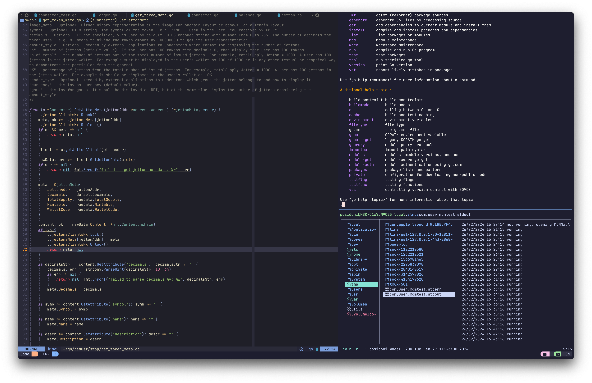

# My config files

## Installation

1) Configs

```sh
# ❗It is non-trivial to make install script that is compatible with arbitrary systems, please,
# carefully read source code before launching anything.

# Also you are responsible for manual backup of existing configs, especially critical system-wide
# configs in /etc/* and custom $XDG_CONFIG_HOME configs.
#
# If you like sth about this repo/want to steal sth, feel free to message me, I'll try to help and
# maybe explain rationale behind some decisions.
$ mkdir -pv "$HOME/myrc"
$ git clone <repo> "$HOME/myrc" && cd "$HOME/myrc"
$ git submodule update --init --recursive # to update tmux plugin manager + omz
$ chmod +x local/bin/install_configs.sh
$ sudo local/bin/install_configs.sh # sudo is required for `/etc/*` manipulation, maybe I'll delete it in future
```

2) Download NVim, patch it, compile & install

```sh
$ local/bin/local/bin/install_latest_nvim.sh # download latest nvim
$ local/bin/patch_neovim.sh # patch neovim variable 'VIMINIT' -> 'NVIMINIT' to decouple vim and nvim

# patching by scripts may not be forward compatible (tested on NVim v0.10)
# generally, it is easy to navigate & patch Nvim sources yourself.
#
# also you may want to consider this popular patch from nvim-ufo issues
# https://github.com/kevinhwang91/nvim-ufo/issues/4
```

3) Bootstrap Tmux + Install TPM plugins

```sh
1. launch tmux session
2. press <leader> + i to install TMP plugins # in my config tmux leader is `~`
```

4) Install NVim plugins (Lazy + TS Parsers)

```sh
1. launch nvim
2. use lazy to install plugins `:Lazy install`
3. install TreeSitter parsers `:TSInstall all`
```

## Additional software

- Recommended terminal emulator: [WezTerm for OS X](https://wezfurlong.org/wezterm/index.html)
- [FiraCode Nerd Font with ligatures & default icons](https://github.com/ryanoasis/nerd-fonts) font or any other font with icons must be used by terminal emulator to render icons properly
- Orbstack
- Obsidian
- Raycast
- Requestly
- Flux
- [TimeOut (must have microbreaks app for OSX)](https://apps.apple.com/it/app/time-out-break-reminders/id402592703?l=en-GB&mt=12)
- all packages from `brew_packages` variable
- some additional binaries for LSP (`:GoDeps`, `rustup`, etc.)

## Nvim config

- My Neovim config is written with mostly lua and uses most modern nvim ecosystem plugins. I try to keep it up to date with latest NVim community developments on the best effort basis.



## Why so many configs

- improve productivity (some tools are IMO must have - tmux/zellij, simple TUIs, tldr, etc.)
- mitigate adhd tax, IDEs == a lot of buttons, nvim == almost 0 disctracting buttons
- make development nicer, 1% more comfortable every day
- almost no other hobbies + some free time
- limited cognitive capacity as a human -> must simplify/automate things, add linters, formatters,
checkers, etc. especially to improve security/reliability of my work output

## Roadmap

- learn to work with git diffs efficiently, build practical & optimal workflow for that
- uninstall super heavy `omz` and replace it with sth more simple/efficient, must have lazy loading,
caching & be compatible with some `omz` plugins
- add some predefined tmux layouts (maybe via `tmuxinator`)
- build decent 🦀 Rust workflow (learn Rust first?)
- find some way to work with Solidity. I just don't enjoy web Remix and online IDEs..
- steal all TypeScript configs from frontend guy [@bezlant](https://github.com/bezlant)
- (maybe) migrate to zellij as a more modern tool, but currently vim support is kind of bad imo
- continue learning, one day become as cool as my teammates

## Board

- factory built moonlander


- with super bad custom foam mod + linear switches + flat caps


- air75 v2 (just nice small board)


## Credits

- [@bezlant](https://github.com/bezlant)
- [Folke](https://github.com/folke)
- [TJ DeVries](https://github.com/tjdevries) - specifically recommend checking out his [PDE - personal development environment Talk](https://www.youtube.com/watch?v=IK_-C0GXfjo)
- [Dreams Of Code](https://github.com/dreamsofcode-io) - stole his catpuccin tmux conf :)
- All other FOSS devs. Thank you! 🙏 I use dozens of things every day - lazygit, k9s, all nice cli stuff, DBs, LSPs, etc. Hopefully one day I also contribute something useful for the community
